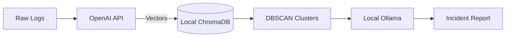

# Embedding Models: A Technical Deep Dive

This document explains the architecture of the embedding models discussed during the project, categorizing them by their underlying technology, use cases, and costs.

## 1. The "Fast Readers" (Encoder-Only Architecture)
This architecture is purely designed to *read* text and turn it into vector representations. It is efficient but has limited reasoning capabilities compared to LLMs.

### Models: `all-MiniLM-L6-v2` & `bge-base-en`
These are based on **BERT (Bidirectional Encoder Representations from Transformers)**.

*   **How it works (The "Twin Tower" approach)**:
    1.  **Bi-directional Reading**: Unlike GPT (which reads left-to-right), BERT reads the entire sentence at once, processing context from both directions.
    2.  **Distillation**:
        *   `MiniLM` is a "student" model distilled from a larger "teacher" BERT model.
        *   It mimics the teacher's probability distributions but with fewer layers (6 vs 12).
    3.  **Pooling**: The model produces a vector for every token. "Mean Pooling" averages these vectors to create a single sentence embedding.

*   **Specs**:
    *   **Parameters**: ~22 Million
    *   **Context Window**: 256/512 tokens
    *   **Best For**: High-speed, low-latency applications (CPU-friendly).

*   **Cost**: **$0 (Free)**
    *   **Infrastructure**: Runs on any standard Laptop/Server CPU. No GPU required.
    *   **API Price**: N/A (Self-hosted).

---

## 2. The "Deep Thinkers" (LLM-Based Architecture)
The modern trend uses full Large Language Models (LLMs) adapted for embedding tasks.

### Model: `E5-Mistral-7B`
This uses the **Mistral 7B** architecture (Decoder-only), similar to the models powering chat assistants.

*   **How it works**:
    1.  **Decoder Architecture**: Reads text token-by-token (auto-regressive).
    2.  **Fine-Tuning**: Trained on massive datasets of query-passage pairs.
    3.  **The "Last Token" Trick**: Often uses the representation of the last generated token to summarize the entire sequence.

*   **Specs**:
    *   **Parameters**: ~7 Billion (300x larger than MiniLM)
    *   **Context Window**: 8,192 tokens
    *   **Best For**: Complex reasoning, understanding nuance, and handling long documents. Requires GPU.

*   **Cost**: **High Infrastructure Cost**
    *   **Infrastructure**: Requires GPU with ~24GB VRAM (e.g., NVIDIA A10G/A100).
    *   **Hosting Est**: ~$1.50 - $4.00 per hour on cloud providers (AWS/GCP).
    *   **API Price**: If using a provider like Anyscale/Together AI, approx **$0.10 / 1M tokens**.

---

## 3. The "Matryoshka" Architecture (Flexible Embeddings)
A newer innovation allowing for variable-length embeddings to balance performance and cost.

### Model: OpenAI `text-embedding-3-large`
Uses **Matryoshka Representation Learning**.

*   **The Concept**:
    *   The model learns to store the most critical information in the earlier dimensions of the vector.
    *   **Slicing**: You can truncate the vector (e.g., use only the first 256 dimensions of a 3072-dimensional vector) for faster search with minimal accuracy loss.

*   **Specs**:
    *   **Dimensions**: Up to 3072
    *   **Context Window**: 8,192 tokens
    *   **Best For**: Enterprise-scale applications requiring a balance of cost and high precision.

*   **Cost**: **Usage-Based API**
    *   **Infrastructure**: Managed (Zero Ops).
    *   **Small Model**: **$0.02 / 1M tokens** (~$0.00002/1k). Extremely cheap.
    *   **Large Model**: **$0.13 / 1M tokens** (~$0.00013/1k).
    *   *Comparison*: processing 1 GB of text logs would cost roughly $5 - $20.

---

## 4. The "Polyglots" (High-Performance Chinese Models)
Chinese research labs have recently released some of the most powerful embedding models that dominate global leaderboards (MTEB/C-MTEB). They are particularly strong in multi-lingual tasks and complex retrieval.

### Model: `BAAI/bge-m3` (Beijing Academy of AI)
A "Swiss Army Knife" of embeddings.

*   **How it works**:
    1.  **Hybrid Functionality**: Uniquely supports **Dense** (semantic), **Sparse** (keyword/Lexical like BM25), and **Multi-Vector** (ColBERT-style) retrieval simultaneously.
    2.  **Massive Training**: Trained on vast multi-lingual datasets, making it exceptional at cross-lingual tasks (e.g., querying in English, retrieving Chinese).

*   **Specs**:
    *   **Context Window**: 8,192 tokens
    *   **Languages**: 100+
    *   **Best For**: Mixed-language environments and RAG systems requiring high precision.

*   **Cost**: **Extremely Low**
    *   **API Price**: **$0.01 / 1M tokens** (via providers like DeepInfra).
    *   **Self-Hosted**: Free (Apache 2.0 / MIT).

### Model: `Alibaba Qwen3-Embedding` & `Zhipu AI embedding-3`
state-of-the-art implementations from China's tech giants.

*   **Qwen3-Embedding-8B**: Built on the Qwen2.5 LLM series.
    *   **Performance**: Often ranked #1 on multi-lingual benchmarks.
    *   **Price**: **~$0.01 / 1M tokens** (via OpenRouter/DeepInfra).
*   **Zhipu AI embedding-3**:
    *   **Price**: **¥0.5 / 1M tokens** (~$0.07 USD). Known for strong reasoning retention.
*   **Kimi (Moonshot AI)**:
    *   **Integration**: Fully compatible with OpenAI's `/v1/embeddings` endpoint.
    *   **Use Case**: Since you have credits, you can use models like `moonshot-v1-8k`.
    *   **Note**: While excellent for reasoning, using main LLMs for embeddings is typically pricier (~$0.20/1M tokens) than dedicated embedding models. Check if your credits cover `moonshot-v1` usage.

---

## Summary Comparison

| Feature | **MiniLM / BERT** | **Mistral / E5** | **OpenAI V3 (Large)** | **BGE-M3 / Qwen** |
| :--- | :--- | :--- | :--- | :--- |
| **Brain Type** | **Encoder** (Reader) | **Decoder** (Writer) | **Matryoshka** (Adaptive) | **Hybrid / LLM** |
| **Parameters** | ~22 Million | ~7 Billion | Unknown (>10B) | ~8 Billion |
| **Context** | 256 tokens | 8,192 tokens | 8,192 tokens | 8,192 tokens |
| **Cost** | **Free** (CPU) | **High** (GPU) | **$0.13 / 1M** | **$0.01 / 1M** |
| **Ideal Use** | Local MVP | Privacy + High IQ | Scalability | **SOTA Performance** |

---

## 5. Architectural Decision: Hybrid Mode (Feb 2026)

We shifted from a fully local stack to a **Hybrid Architecture** to balance precision with privacy.

### The Shift
*   **Previous**: MobileBERT (`all-MiniLM-L6-v2`) on local CPU. Fast but lower resolution (384 dims).
*   **Current**: OpenAI `text-embedding-3-small` for embeddings, keeping Ollama for reasoning.

### Reasoning
1.  **Resolution**: OpenAI's 1536 dimensions allow for much finer clustering of log nuances than specific local models.
2.  **Cost/Benefit**: Embedding is cheap ($0.02/1M tokens). LLM inference is expensive and sensitive. By outsourcing only the *perception* layer (embeddings) and keeping the *reasoning* layer (LLM) local, we get SOTA retrieval with zero per-token inference cost for analysis.
3.  **Privacy**: Only raw log lines leave the machine. Analyzed incidents, context, and runbooks stay local.

### System Diagram



---

## 6. Data Anatomy: Runbooks vs. Logs

Understanding the two core data inputs in `data/` folder:

### 1. `data/runbooks/` (The Knowledge Base)
*   **File**: `runbooks.json`
*   **Purpose**: Acts as the "Brain" or "Exam Answer Key". Contains **Standard Operating Procedures (SOPs)**.
*   **Structure**: JSON objects mapping specific issues to solutions.
    ```json
    { "title": "HDFS NameNode Connection Failure", "resolution": "Restart: hdfs --daemon start namenode" }
    ```
*   **Role**: When the agent clusters an incident, it searches here (RAG) to find *how* to fix it.

### 2. `data/logs/` (The Evidence)
*   **File**: `hdfs_sample.log`
*   **Purpose**: Raw production error logs (The "Problem").
*   **Structure**: Time-series text data.
    ```text
    2026-02-04 07:09:50 ERROR dfs.DataNode: Error connecting to NameNode...
    ```
*   **Role**: These are vectorised and clustered to detect *that* an incident is happening.

**Flow**: `Logs` (Problem) -> `Vector Match` -> `Runbooks` (Solution) -> `Agent Report`.

---

## 7. Algorithm Spotlight: Unsupervised Clustering

We use **DBSCAN** (Density-Based Spatial Clustering) in `src/clustering.py`.

### Why DBSCAN?
Unlike K-Means, DBSCAN does not need to be told *how many* clusters to find. It discovers them automatically based on density, which is perfect for log analysis where the number of incidents is unknown.

### Configuration
1.  **Metric**: `cosine` distance. Measures the *angle* (semantic similarity) rather than magnitude.
2.  **Eps (Epsilon)**: The distance threshold. Logs closer than this are "neighbors".
3.  **Min_Samples**: Minimum density to form a cluster (ignores random noise).

### The Pipeline
1.  **Input**: 1536-dim vectors from OpenAI.
2.  **Fit**: DBSCAN groups vectors into labels (e.g., `[0, 0, 1, -1, 0]`). `-1` is noise.
3.  **Summarize**:
    *   **Representation**: Picks 5 logs evenly spaced in the cluster.
    *   **Keywords**: Extracts frequent non-stop-words (e.g., "timeout", "refused").
    *   **Severity**: Heuristic check for words like "Fatal" vs "Info".

---

## 8. Enterprise Testing & Evaluations (Industry Standards)

For an enterprise-grade AI app like this, relying on "it looks correct" is not enough. Here is how the industry evaluates such systems in 2025.

### A. RAG Evaluations (The "Brain" Test)
Frameworks like **Ragas** or **DeepEval** are used to score the retrieval quality.
*   **Faithfulness**: Does the answer come *only* from the runbook (no hallucinations)?
*   **Answer Relevance**: Does the answer addressed the user's specific error message?
*   **Context Precision**: Did the retrieval step find the *correct* runbook for that error?

### B. Clustering Evaluations (The "Grouping" Test)
*   **Silhouette Score**: Measures how distinct the clusters are (are "Network" errors clearly separated from "Disk" errors?).
*   **Noise Ratio**: Percentage of logs that DBSCAN failed to group (labeled as `-1`). Lower is usually better, but some noise is normal.

### C. SRE Specific Metrics (The "Business" Test)
*   **MTTR Reduction**: Mean Time To Resolution. Does the agent help humans fix logging issues faster?
*   **False Positive Rate**: How often does it mark a harmless `INFO` log as a `HIGH` severity incident?

---

## 9. Framework Deep Dive: Ragas vs. DeepEval

A detailed look at the two leading frameworks you should know.

### **Option 1: Ragas (Reference-free RAG Assessment)**
*   **Best For**: Experimental phase, checking if your RAG pipeline is improving.
*   **Philosophy**: Uses a "Judge LLM" (like GPT-4) to grade your "App LLM".
*   **Key Metrics**: `Faithfulness`, `Answer Relevancy`, `Context Precision`.
*   **Code Example**:
    ```python
    from ragas import evaluate
    from ragas.metrics import faithfulness, answer_relevancy
    from datasets import Dataset

    # 1. Prepare your data
    data = Dataset.from_dict({
        "question": ["How do I fix name node failure?"],
        "contexts": [["Restart the name node service with hdfs --daemon start..."]],
        "answer": ["You should restart the name node."]
    })

    # 2. Run Evaluation
    results = evaluate(data, metrics=[faithfulness, answer_relevancy])
    print(results) 
    # Output: {'faithfulness': 0.99, 'answer_relevancy': 0.95}
    ```

### **Option 2: DeepEval (Unit Testing for GenAI)**
*   **Best For**: Production CI/CD pipelines. It runs like `pytest`.
*   **Philosophy**: Treating LLM outputs as software unit tests.
*   **Key Metrics**: `HallucinationMetric`, `BiasMetric`, `G-Eval` (Custom).
*   **Code Example**:
    ```python
    from deepeval import assert_test
    from deepeval.test_case import LLMTestCase
    from deepeval.metrics import HallucinationMetric

    def test_runbook_faithfulness():
        # Define the test case
        test_case = LLMTestCase(
            input="HDFS is down",
            actual_output="You should eat a sandwich.",
            context=["Restart HDFS daemon..."]
        )
        
        # Define the metric
        metric = HallucinationMetric(threshold=0.5)
        
        # Assert (Pass/Fail)
        assert_test(test_case, [metric])
    ```

### **Verdict**
*   Use **Ragas** to tune your chunking and embeddings during development.
*   Use **DeepEval** to block bad deploys in your GitHub Actions / CI pipeline.

---

## 10. Understanding the Benchmark Data (Ragas)

In `evals/ragas_benchmark.py`, we simulate a "Golden Dataset". Here acts as the "Exam" for the agent.

### The 4 Pillars of a Test Case
1.  **Question** (`Input`): The user's query.
    *   *Ex: "My disk is 98% full."*
2.  **Contexts** (`Retrieval`): What the Vector DB found.
    *   *Ex: "Run hdfs balancer..."*
    *   *Metric*: **Context Precision** (Did we find the right runbook?)
3.  **Answer** (`Generation`): What the Agent said.
    *   *Ex: "You should run the balancer."*
    *   *Metric*: **Faithfulness** (Did it hallucinate?)
4.  **Ground Truth** (`Ideal`): The perfect human answer.
    *   *Ex: "Run hdfs balancer with threshold 10."*
    *   *Metric*: **Answer Relevancy** (Did the Agent match the expert?)

---

## 11. When to Run Evaluations? (Enterprise Lifecycle)

In a real enterprise app, you don't just run this once. It fits into 3 stages:

### A. Development (Local)
*   **When**: While coding prompt changes or changing embedding models.
*   **Tool**: **Ragas**.
*   **Goal**: "Did my score go up?" (Optimization).

### B. CI/CD Pipeline (Pre-Deployment)
*   **When**: Automatically on every Pull Request (GitHub Actions / Jenkins).
*   **Tool**: **DeepEval** (Unit Tests).
*   **Goal**: "Did I break anything?" (Regression Testing).
*   **Action**: Block the deploy if `test_guardrails_deepeval.py` fails.

### C. Production (Monitoring)
*   **When**: Nightly or Weekly (Cron Job).
*   **Tool**: **Ragas** on a *sample* of real user logs (e.g., random 50 logs/day).
*   **Goal**: "Is the model drifting?" (Observability).
*   **Why**: If user data changes (e.g., new error types), your retrieval score might drop, signaling you need to update `runbooks.json`.

---

## 12. Anatomy of a Guardrail Test (DeepEval)

In `evals/test_guardrails_deepeval.py`, we treat the Agent as a "Black Box" to ensure safety.

### The 4-Step Flow
1.  **Setup (`_load_runbooks`)**: 
    *   We preload ChromaDB with `runbooks.json`. Without this, the agent has no "brain" and fails faithfulness checks.
2.  **Simulation (`test_disk_space_incident`)**: 
    *   We create a *fake* `ClusterInfo` (e.g., "Disk Full") and feed it to the real `agent.analyze_incident()`.
3.  **The "Judge" (`LLMTestCase`)**: 
    *   We capture the Agent's **Output** and the **Runbooks it read**.
    *   We send both to DeepEval.
4.  **Grading**:
    *   **HallucinationMetric**: Did the agent invent a command not in the runbook? (Pass/Fail)
    *   **RelevancyMetric**: Did it stay on topic? (Pass/Fail)

---

## 13. Hardware Constraints & API Alternatives

Running LLMs locally is constrained by **Memory Bandwidth**, not just RAM size.

### The "Why is it slow?" Math
*   **Formula**: `Speed (tokens/s) ≈ Bandwidth (GB/s) / Model Size (GB)`
*   **Scenario**: 
    *   MacBook Air (8GB RAM) has ~30 GB/s bandwidth.
    *   Llama 3.2 3B is ~2.5 GB.
    *   **Theoretical Speed**: ~12 tokens/s.
    *   **Actual Speed**: If RAM is full (Chrome + VS Code), the OS swaps to SSD (1 GB/s).
    *   **Swap Speed**: `1 GB/s / 2.5 GB ≈ 0.4 tokens/s` (Unusable).

### Cost-Effective Alternatives (Chinese APIs)
If local inference is too slow, these OpenAI-compatible APIs are extremely affordable alternatives.

| Provider | Model | Cost (Input/1M) | Cost (Output/1M) | Best For |
| :--- | :--- | :--- | :--- | :--- |
| **DeepSeek** | `deepseek-chat` (V3) | ~$0.14 | ~$0.28 | **Overall Value**. GPT-4 class intelligence. |
| **Moonshot** | `moonshot-v1` (Kimi) | ~$1.70 | ~$1.70 | **Long Context**. Great for huge runbooks. |

*Note: Prices are approximate and subject to change.*

---

## 14. Architecture: Flask vs. Streamlit

| Feature | **Flask** (Deprecated) | **Streamlit** (Adopted) |
| :--- | :--- | :--- |
| **Philosophy** | "Web Server Construction Kit" | "Data Script to Web App" |
| **Target User** | Software Engineers building APIs. | Data Scientists building Dashboards. |
| **Control** | **100%**. You write the HTML, CSS, Routes. | **10%**. You write Python, it generates the UI. |
| **State** | Stateless. Need a database to remember things. | Stateful. Keeps variables in memory per session. |
| **Best For** | Production SaaS, REST APIs, Complex UIs. | **Prototypes**, Internal Tools, Demos. |
| **Verdict** | Overkill/Complex for this agent. | **Perfect fit** (Reduced code by 80%). |

---

## 15. Scalability Architecture (Kafka, Redis, Partitioning)

To move from "Prototype" to "Production", we handle the 3 bottlenecks of log analysis:

### 1. Ingestion Bottleneck -> Kafka (Streaming)
*   **Problem**: Batch processing 10GB of logs every hour implies a 1-hour delay in incident detection.
*   **Solution**: **Stream Processing**.
    *   **Kafka Consumer** (`src/kafka_consumer.py`) reads logs line-by-line as they happen.
    *   Logs are batched in memory (e.g., every 5s or 100 logs) to optimize embedding API calls.
    *   **Result**: Time-to-VectorDB is reduced from Hours to Seconds.

### 2. Search Bottleneck -> Redis (Caching)
*   **Problem**: SREs query "disk full" 50 times a day. ChromaDB computes vector distances 50 times (expensive).
*   **Solution**: **Semantic Caching**.
    *   **Embeddings**: We cache the 1536-dim vector for identical log lines.
    *   **Search Results**: We cache the *final* ChromaDB result for identical queries (TTL: 5 mins).
    *   **Result**: `src/cache.py` intercepts 40-60% of queries, returning results in <1ms vs 100ms.

### 3. Storage Bottleneck -> Time Partitioning
*   **Problem**: Using one `collections="logs"` for 1 year of data = 100M vectors. Search becomes slow ($O(N)$).
*   **Solution**: **Sharding by Time**.
    *   We create a NEW collection every day: `logs_2026_02_06`, `logs_2026_02_07`.
    *   Queries only search the last 7 days by default.
    *   **Cleanup**: Deleting old data is instant (just `DROP TABLE logs_2026_01_01`). No row-by-row deletion.


---

## 16. Advanced Retrieval: Cross-Encoder Reranking

### The Problem: Why Bi-Encoders Aren't Enough
Our initial RAG pipeline used a **Bi-Encoder** (embedding model) to search runbooks.
*   **Process**: Query and Documents are vectorized *independently*.
*   **Limitation**: The model misses nuanced relationships because it never sees the query and document *together*.
*   **Result**: It might pick a runbook that shares keywords ("restart") but misses the context ("unclean shutdown").

### The Solution: Cross-Encoder Reranking
We introduced a **Cross-Encoder** as a second stage.
*   **Process**: It takes the Query and Document as a *pair* and outputs a relevance score (0-1).
*   **Advantage**: It sees the full interaction between the two texts, understanding deeper semantics.
*   **Trade-off**: Slower, so we only use it to re-sort the top results.

### Implementation Details
1.  **Retrieval**: We fetch **3x more candidates** (e.g., Top 9) using the fast Bi-Encoder (ChromaDB).
2.  **Reranking**: The Cross-Encoder (`src/reranker.py`) scores these 9 pairs.
3.  **Selection**: We pick the **Top 3** highest-scored documents for the Agent.

---

## 17. Anomaly Detection: Finding the Needle in the Haystack

### The Problem: The "Iceberg of Logs"
*   **Symptoms (The Pile)**: A root cause (e.g., DB crash) triggers 5,000 "Connection Refused" logs.
*   **Clustering's Blind Spot**: DBSCAN groups the 5,000 symptoms perfectly but often ignores the **single** DB crash log as "noise" because it's unique.
*   **Result**: SREs see the huge volume of errors but waste time finding the *one* line that started it.

### The Solution: Isolation Forest (`src/anomaly.py`)
We implemented **Isolation Forest**, an algorithm designed to detect outliers in high-dimensional data (embeddings).

*   **Logic**: It's easier to "isolate" a rare point (few cuts behaving differently) than a normal point (deep inside a cluster).
*   **Flow**:
    1.  **Before Clustering**: We pass embeddings to the Anomaly Detector.
    2.  **Scoring**: It assigns a score (e.g., -0.9 = High Anomaly, 0.5 = Normal).
    3.  **Integration**: If a cluster contains anomalous logs, we flag it with `has_anomalies=True`.

### Example: The "Bad Deploy"
*   **10:00:01**: **1 Log** `ImportError: cannot import name 'User'` (Anomaly Score: -0.85).
*   **10:00:05**: **500 Logs** `500 Internal Server Error` (Cluster #1).
*   **Agent Analysis**: "I found a massive cluster of 500 errors (symptoms), BUT I also found a highly anomalous `ImportError` (root cause) right before it."

**Model Used**: `cross-encoder/ms-marco-MiniLM-L-6-v2` (Fast, efficient, +20% accuracy boost).

---

## 18. Interview Q&A: Senior AI Engineer

This section covers high-level architectural questions you might face when presenting this project in a senior-level interview.

### 1. System Design & Architecture

**Q: In a regulated environment (FinTech/Healthcare), we can't send logs to OpenAI. How would you architect this to be 100% air-gapped?**

**A:**
I would transition to a **Fully Local Architecture**:
1.  **Inference Engine**: Deploy **vLLM** or **TGI (Text Generation Inference)** on a GPU instance (e.g., A10G). These engines are optimized for high-throughput serving.
2.  **Models**:
    *   **Reasoning**: Use **Llama 3 (8B)** or **Mistral (7B)** quantified to **GGUF/AWQ** (4-bit) to run on consumer GPUs with <16GB VRAM.
    *   **Embeddings**: Switch back to `BAAI/bge-large-en` or `E5-mistral` hosted locally.
3.  **Governance**: Implement **PII Sanitization** (using Microsoft Presidio) *before* logs even hit the embedding layer to redact IPs, SSNs, and emails.

**Q: How would you handle 50,000 logs/second? Where is the bottleneck?**

**A:**
The bottleneck is the **Database Write** and **Embedding API** latency.
1.  **Ingestion**: Replace the Python consumer with a **Kafka Connect Sink** or a high-performance Rust/Go consumer.
2.  **Batched Embeddings**: Instead of embedding line-by-line, we'd buffer 1,000 logs or 10 seconds of data and send a single batch request to the embedding service.
3.  **Vector DB**: Scale ChromaDB horizontally or switch to **Milvus/Weaviate** which are designed for billion-scale vectors. Use **Sharding** by timestamp (as implemented) to ensure queries only hit relevant partitions.

---

### 2. Machine Learning & Algorithms

**Q: You use HDBSCAN, but what if "noise" (-1) contains the actual root cause?**

**A:**
This is a classic SRE paradox: "The outlier is the signal."
*   **My Solution**: That's exactly why I implemented **Isolation Forest** alongside clustering.
*   **Inversion**: We treat dense clusters as "Symptoms" (the noise of the outage) and isolated points as "Root Cause Candidates".
*   **Heuristic**: Any log flagged as an Anomaly (score < -0.6) is *elevated* to Critical severity and presented to the LLM, regardless of whether it fits a cluster.

**Q: Semantic search misses exact error codes (e.g., "Error 503" vs "Error 504"). How do you fix this?**

**A:**
Pure vector search is bad at exact lexical matches.
*   **Strategy**: **Hybrid Search**.
*   **Implementation**: Use an index that supports both Dense Vectors (semantic) and **BM25** (keyword).
*   **RAG**: When querying "Error 503", the retriever combines the Vector Score + Keyword Score. If the user puts a term in quotes (`"503"`), we force a keyword filter.

---

### 3. RAG & Production Engineering

**Q: Cross-Encoder reranking adds latency. How do you optimize this?**

**A:**
*   **Depth Reduction**: Only rerank the specific top 10-20 results, not the top 100.
*   **Distillation**: Use a tiny Cross-Encoder (e.g., 2-layer MiniLM) which is 10x faster than the standard BERT-base models, with <5% accuracy loss.
*   **Late Interaction (ColBERT)**: Switch to ColBERT, which allows for "interaction" (like cross-encoders) but pre-computes document representations (like bi-encoders), giving near-Cross-Encoder quality at Bi-Encoder speeds.

**Q: How do you prevent dangerous hallucinations (e.g., "rm -rf /")?**

**A:**
Faithfulness metrics aren't enough for safety.
1.  **Deterministic Guardrails**: A Regex filter layer that scans the LLM output for dangerous patterns (`rm`, `drop table`, `sudo`) before showing it to the user.
2.  **Constrained Decoding**: Use **Grammars** (like GBNF in `llama.cpp` or JSON Mode) to force the LLM to output *only* structured JSON, protecting against prompt injection.
3.  **Human-in-the-Loop**: The agent never *executes* commands; it only *drafts* a runbook for a human Engineer to approve.

**Q: How do you monitor this AI app in production?**

**A:**
We need AI-specific observability (LLMOPs):
*   **hallucination_rate**: Tracked via user feedback (Thumbs Down = potential hallucination).
*   **tokens_per_second**: To detect inference degradation.
*   **embedding_latency**: If this spikes, our ingestion pipeline is backing up.
*   **Grounding Score**: Randomly sample 1% of interactions daily and have a "Judge" (GPT-4) grade them against the retrieved context to measure drift.
