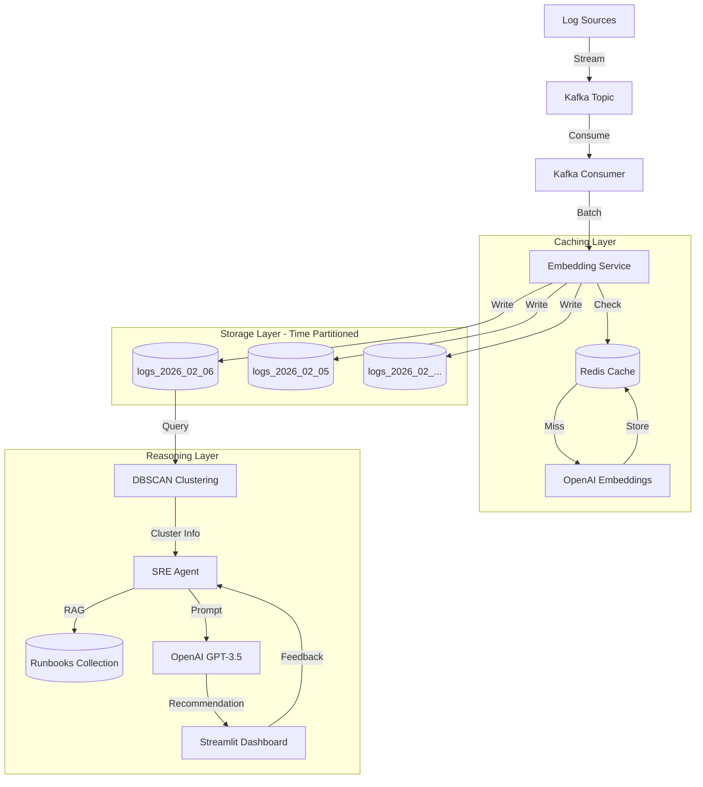

# Autonomous SRE Agent

An intelligent agent that ingests raw logs, clusters them into incidents, investigates root causes using RAG, and drafts fixes for human approval.

## Features

- **Log Ingestion & Clustering**: Uses DBSCAN to group similar log entries
- **RAG-based Investigation**: Searches runbooks and past incidents for context
- **Human-in-the-Loop Learning**: Learns from user feedback to improve over time
- **Web Dashboard**: View alerts, provide feedback, and monitor incidents

## Tech Stack

- **Embeddings**: **OpenAI `text-embedding-3-small`** (Cloud, 1536-dim)
- **Vector DB**: ChromaDB (Time-partitioned, local persistence)
- **LLM**: **OpenAI `gpt-3.5-turbo`** (Cloud)
- **Web Framework**: **Streamlit** (Python-only UI)
- **Clustering**: DBSCAN (scikit-learn)
- **Streaming**: Kafka (Optional, real-time ingestion)
- **Caching**: Redis (Optional, 40-60% fewer DB queries)

## Architecture



## Prerequisites

1. **Python 3.10+**
2. **OpenAI API Key** (Set in `.env`)

## Installation

```bash
# Create virtual environment
python -m venv venv
source venv/bin/activate  # On Windows: venv\Scripts\activate

# Install dependencies
pip install -r requirements.txt
```

## Usage

```bash
# Start the application
streamlit run streamlit_app.py
# Opens browser at http://localhost:8501
```

## Project Structure

```
├── data/
│   ├── logs/              # Log files to analyze
│   └── runbooks/          # Runbooks for RAG
├── src/
│   ├── embeddings.py      # OpenAI/Local embedding service
│   ├── clustering.py      # DBSCAN clustering
│   ├── vectordb.py        # ChromaDB with caching + partitioning
│   ├── cache.py           # Redis caching layer
│   ├── kafka_consumer.py  # Kafka streaming consumer
│   ├── rag.py             # RAG retrieval logic
│   └── agent.py           # Main agent logic
├── evals/                 # Ragas/DeepEval benchmarks
├── streamlit_app.py       # Main Streamlit application
└── requirements.txt
```

## Data Source

Uses [Loghub](https://github.com/logpai/loghub) HDFS dataset for real production logs.

## License

MIT
